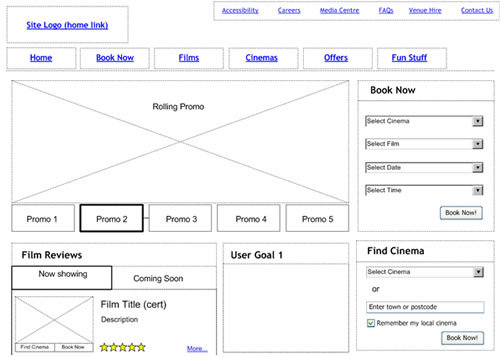
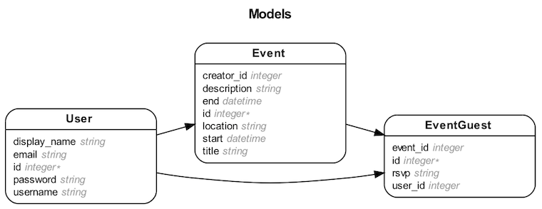

# Final Project

## TODO: Submit your wireframes in the form of a pull request

This example wireframe lives in `readme_assets/wireframe_example.jpg`

Swap it out with your actual wireframes...

## TODO: Submit your ERD in the form of a pull request

This example Entity Relational Diagram lives in `readme_assets/erd_example.png`

Swap it out with your actual ERD...

## Deployment

If your project uses the `react_on_rails` gem, you will need to:

* `heroku create your-app-name`
* `heroku buildpacks:set --index 1 heroku/nodejs`
* `heroku buildpacks:add heroku/ruby`
* `git push heroku master`
* `heroku run rails db:migrate`
* optional: `heroku run rails db:seed`

## Instructor Checklist

* Clone this repo, create a new one
* Set branch protection rules on `master` (There is a CODEOWNERS file in this repo, but it is up to you how you want to use it.)
* Create a Slack Channel, invite team members and TAs
* in Slack: `/github subscribe wyncode/repo_name issues,reviews,comments`
